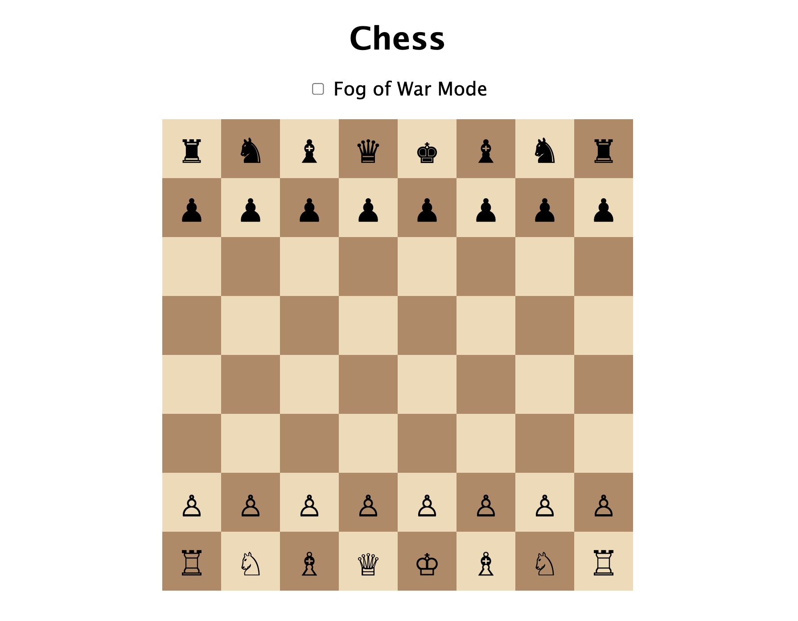

# ♟️ Fog of War Chess

[](https://www.python.org/)
[](https://flask.palletsprojects.com/)
[](LICENSE)

A web-based chess game featuring an optional **Fog of War** mode, where players can only see their own pieces and enemy pieces they are able to capture. Perfect for testing both your tactics and intuition.

---

## 📸 Screenshots

<p align="center">
  
  
</p>

---

## 🎮 Features

- Classic chess gameplay with basic move logic
- Toggleable **Fog of War** mode
- Dynamic, responsive chessboard rendered in the browser
- Visual turn indicator and game-over overlay
- Easy-to-reset game state
- Clean UI with Unicode chess pieces

---

## 🚀 Getting Started

### 1. Clone the repository

```bash
git clone https://github.com/helloiamcait/chess_game.git
cd chess_game
```

### 2. Create and activate a virtual environment (recommended)
#### Create:
```bash
python -m venv venv
```
#### Activate:
```
source venv/bin/activate       # macOS/Linux
venv\Scripts\activate          # Windows
```

### 3. Install dependencies

```bash
pip install -r requirements.txt
```

### 4. Run the Flask app

```bash
# macOS/Linux
export FLASK_APP=app.py
flask run

# Windows CMD
set FLASK_APP=app.py
flask run

# Windows PowerShell
$env:FLASK_APP = "app.py"
flask run
```
Then visit http://127.0.0.1:5000 in your browser.

---

## 🧠 Fog of War Mode
Use the checkbox above the board to toggle Fog of War. 

When enabled:
* You can only see your own pieces
* Opponent pieces are hidden (`·`) unless capturable
* Each turn updates what you see based on your pieces

When disabled:
* The full board is visible from a neutral audience view

---

## 📁 Project Structure

```graphql
├── app.py
├── chess_logic.py
├── static/
│   ├── style.css
│   └── chess.js
├── templates/
│   └── index.html
├── requirements.txt
├── .gitignore
└── README.md
```

---

## ✅ TODO / Future Features

* Move validation UI feedback
* Highlight possible moves
* Multiplayer (shared device or online)
* Move history and replay
* Time control options
* Deploy to Render or Replit

---

## 🤝 Contributing

Pull requests are welcome! For major changes, please open an issue first to discuss what you’d like to change or improve.

---

## 📝 License

MIT License. Use freely, modify wildly, and don’t forget to tag me if you improve it!

---

## ✍️ Author

### Cait
Built with love, curiosity, and Unicode chess pieces ♞


